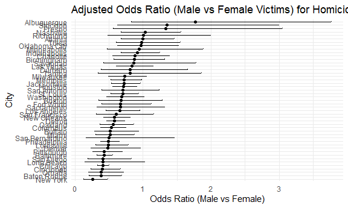

p8105_hw6_csl2209
================
Casandra Laney
2025-12-03

## Problem 1

Create a city_state variable (e.g. “Baltimore, MD”), and a binary
variable indicating whether the homicide is solved. Omit cities Dallas,
TX; Phoenix, AZ; and Kansas City, MO – these don’t report victim race.
Also omit Tulsa, AL – this is a data entry mistake. For this problem,
limit your analysis those for whom victim_race is white or black. Be
sure that victim_age is numeric.

``` r
homicide_data = 
  read_csv("data/homicide-data.csv") |>
  mutate(
    city_state = str_c(city, state, sep = ", "),
    resolved = as.numeric(disposition == "Closed by arrest"),
    victim_age = as.numeric(victim_age),
    victim_race = fct_relevel(victim_race, "White")) |> 
  filter(
    !city_state %in% 
      c("Dallas, TX", "Phoenix, AZ", "Kansas City, MO", "Tulsa, AL")) |>
  filter(victim_race %in% c("White", "Black"))
```

    ## Rows: 52179 Columns: 12
    ## ── Column specification ────────────────────────────────────────────────────────
    ## Delimiter: ","
    ## chr (9): uid, victim_last, victim_first, victim_race, victim_age, victim_sex...
    ## dbl (3): reported_date, lat, lon
    ## 
    ## ℹ Use `spec()` to retrieve the full column specification for this data.
    ## ℹ Specify the column types or set `show_col_types = FALSE` to quiet this message.

    ## Warning: There was 1 warning in `mutate()`.
    ## ℹ In argument: `victim_age = as.numeric(victim_age)`.
    ## Caused by warning:
    ## ! NAs introduced by coercion

For the city of Baltimore, MD, use the glm function to fit a logistic
regression with resolved vs unresolved as the outcome and victim age,
sex and race as predictors. Save the output of glm as an R object; apply
the broom::tidy to this object; and obtain the estimate and confidence
interval of the adjusted odds ratio for solving homicides comparing male
victims to female victims keeping all other variables fixed.

``` r
baltimore_df =
  homicide_data |>
  filter(city == "Baltimore")

fit_logistic = 
  baltimore_df |> 
  glm(resolved ~ victim_age + victim_race + victim_sex, data = _, family = binomial()) 

tidy_fit =
  fit_logistic |> 
  broom::tidy(conf.int = TRUE) |> 
  mutate(
    OR = exp(estimate),
    OR_low = exp(conf.low),
    OR_high = exp(conf.high)
  )

# Extract OR comparing male vs female victims
male_OR =
  tidy_fit |>
  filter(term == "victim_sexMale") |>
  select(term, OR, OR_low, OR_high)

male_OR
```

    ## # A tibble: 1 × 4
    ##   term              OR OR_low OR_high
    ##   <chr>          <dbl>  <dbl>   <dbl>
    ## 1 victim_sexMale 0.426  0.324   0.558

Now run glm for each of the cities in your dataset, and extract the
adjusted odds ratio (and CI) for solving homicides comparing male
victims to female victims. Do this within a “tidy” pipeline, making use
of purrr::map, list columns, and unnest as necessary to create a
dataframe with estimated ORs and CIs for each city.

``` r
city_OR =
  homicide_data |>
  nest(data = -city) |>
  mutate(
    fit = map(data, ~ glm(resolved ~ victim_age + victim_race + victim_sex,
                          data = .x, family = binomial())),
    tidy = map(fit, ~ broom::tidy(.x, conf.int = TRUE)),
    tidy = map(tidy, ~ 
                 .x |>
                   mutate(
                     OR = exp(estimate),
                     OR_low = exp(conf.low),
                     OR_high = exp(conf.high)
                   ) |>
                   filter(term == "victim_sexMale") |>
                   select(term, OR, OR_low, OR_high)
              )
  ) |>
  select(city, tidy) |>
  unnest(tidy)
```

    ## Warning: There were 44 warnings in `mutate()`.
    ## The first warning was:
    ## ℹ In argument: `tidy = map(fit, ~broom::tidy(.x, conf.int = TRUE))`.
    ## Caused by warning:
    ## ! glm.fit: fitted probabilities numerically 0 or 1 occurred
    ## ℹ Run `dplyr::last_dplyr_warnings()` to see the 43 remaining warnings.

Create a plot that shows the estimated ORs and CIs for each city.
Organize cities according to estimated OR, and comment on the plot.

``` r
city_OR |>
  mutate(city = fct_reorder(city, OR)) |>        # reorder by OR
  ggplot(aes(x = OR, y = city)) +
  geom_point() +
  geom_errorbarh(aes(xmin = OR_low, xmax = OR_high), height = 0.2) +
  labs(
    title = "Adjusted Odds Ratio (Male vs Female Victims) for Homicide Resolution",
    x = "Odds Ratio (Male vs Female)",
    y = "City"
    )
```



## Problem 2

``` r
library(p8105.datasets)
data("weather_df")
```

Use 5000 bootstrap samples and, for each bootstrap sample, produce
estimates of these two quantities.

Plot the distribution of your estimates, and describe these in words.

Using the 5000 bootstrap estimates, identify the 2.5% and 97.5%
quantiles to provide a 95% confidence interval for r^2 and
β<sup>1β</sup>2.

## Problem 3

Load and clean the data for regression analysis (i.e. use appropriate
variable names, convert numeric to factor where appropriate, check for
the presence of missing data, etc.).

``` r
birthweight_df = 
  read_csv("data/birthweight.csv") |>
  janitor::clean_names() |>
  drop_na() |>
  mutate(
    babysex = as.factor(
      case_match(babysex,
      1 ~ "male",
      2 ~ "female"
    )),
    frace = as.factor(
      case_match(frace,
      1 ~ "White",
      2 ~ "Black",
      3 ~ "Asian",
      4 ~ "Puerto Rican",
      8 ~ "Other",
      9 ~ "Unknown")),
    malform = as.factor(
      case_match(malform,
      0 ~ "absent",
      1 ~ "present"
    )),
    mrace = as.factor(
      case_match(mrace,
      1 ~ "White",
      2 ~ "Black",
      3 ~ "Asian",
      4 ~ "Puerto Rican",
      8 ~ "Other")),
    bhead = as.numeric(bhead),
    blength = as.numeric(blength),
    bwt = as.numeric(bwt),
    delwt = as.numeric(delwt),
    fincome = as.numeric(fincome),
    gaweeks = as.numeric(gaweeks),
    menarche = as.numeric(menarche),
    mheight = as.numeric(mheight),
    momage = as.numeric(momage),
    parity = as.numeric(parity),
    pnumlbw = as.numeric(pnumlbw),
    pnumsga = as.numeric(pnumsga),
    ppbmi = as.numeric(ppbmi),
    ppwt = as.numeric(ppwt),
    smoken = as.numeric(smoken),
    wtgain = as.numeric(wtgain)
    )
```

    ## Rows: 4342 Columns: 20
    ## ── Column specification ────────────────────────────────────────────────────────
    ## Delimiter: ","
    ## dbl (20): babysex, bhead, blength, bwt, delwt, fincome, frace, gaweeks, malf...
    ## 
    ## ℹ Use `spec()` to retrieve the full column specification for this data.
    ## ℹ Specify the column types or set `show_col_types = FALSE` to quiet this message.

Propose a regression model for birthweight. This model may be based on a
hypothesized structure for the factors that underly birthweight, on a
data-driven model-building process, or a combination of the two.

Proposed regression model: bwt= β0 \* + β1 \* gaweeks + β2 \* babysex +
β3 \* smoker+β4 \* momage +β5 \* fincome + ε

``` r
mlr_fit = lm(bwt ~ gaweeks + babysex + smoken + momage + fincome, data = birthweight_df)

mlr_fit |> 
  broom::glance()
```

    ## # A tibble: 1 × 12
    ##   r.squared adj.r.squared sigma statistic   p.value    df  logLik    AIC    BIC
    ##       <dbl>         <dbl> <dbl>     <dbl>     <dbl> <dbl>   <dbl>  <dbl>  <dbl>
    ## 1     0.205         0.204  457.      223. 1.82e-212     5 -32752. 65517. 65562.
    ## # ℹ 3 more variables: deviance <dbl>, df.residual <int>, nobs <int>

Describe your modeling process and show a plot of model residuals
against fitted values – use add_predictions and add_residuals in making
this plot.

**To create this model, I started with variables that I hypothesized
could impact the baby’s birthweight, and removed variables if they
significantly increased the p- value.**

Compare your model to two others:

- One using length at birth and gestational age as predictors (main
  effects only)

``` r
age_fit = lm(bwt ~ blength + gaweeks, data = birthweight_df)

age_fit |> 
  broom::glance()
```

    ## # A tibble: 1 × 12
    ##   r.squared adj.r.squared sigma statistic p.value    df  logLik    AIC    BIC
    ##       <dbl>         <dbl> <dbl>     <dbl>   <dbl> <dbl>   <dbl>  <dbl>  <dbl>
    ## 1     0.577         0.577  333.     2958.       0     2 -31381. 62771. 62796.
    ## # ℹ 3 more variables: deviance <dbl>, df.residual <int>, nobs <int>

- One using head circumference, length, sex, and all interactions
  (including the three-way interaction) between these

``` r
interaction_fit = lm(bwt ~ babysex + bhead + blength +  bwt + delwt +  fincome + frace + gaweeks + malform + menarche + mheight + momage + mrace + parity + pnumlbw + pnumsga + ppbmi + ppwt +smoken + wtgain, data = birthweight_df)
```

    ## Warning in model.matrix.default(mt, mf, contrasts): the response appeared on
    ## the right-hand side and was dropped

    ## Warning in model.matrix.default(mt, mf, contrasts): problem with term 4 in
    ## model.matrix: no columns are assigned

``` r
interaction_fit |> 
  broom::glance()
```

    ## # A tibble: 1 × 12
    ##   r.squared adj.r.squared sigma statistic p.value    df  logLik    AIC    BIC
    ##       <dbl>         <dbl> <dbl>     <dbl>   <dbl> <dbl>   <dbl>  <dbl>  <dbl>
    ## 1     0.718         0.717  272.      525.       0    21 -30498. 61042. 61189.
    ## # ℹ 3 more variables: deviance <dbl>, df.residual <int>, nobs <int>

Make this comparison in terms of the cross-validated prediction error;
use crossv_mc and functions in purrr as appropriate.
